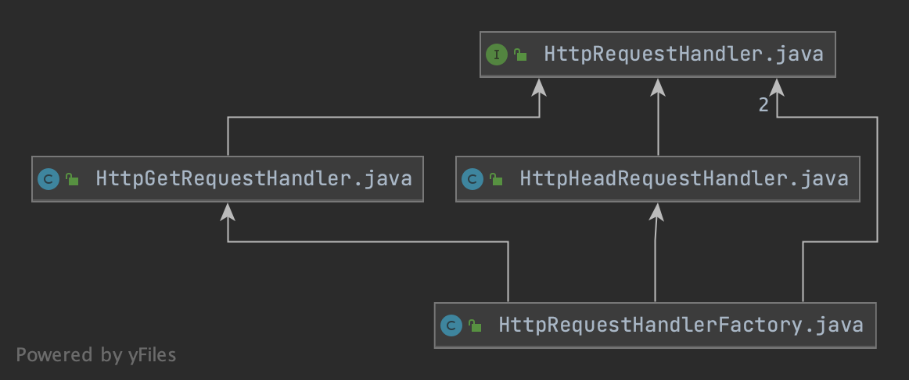

# HTTP Server

A simple, dockerized HTTP server, offering GET and HEAD methods for serving static files.

# Build and run it

1. Build the Docker image

`$ docker build -t http-server .` or `$ maven clean package -P docker`

2. Run

// TODO: Explain

``` bash
$ docker run 
    -v /path/to/www:/usr/app/www \
    -v /path/to/config.yml:/usr/app/config.yml \
    -p 8080:8080 \ 
    http-server`
```

# Configuration

# Explanation of the implementation approach

This application consists of a web server implemented using the Java NIO (non-blocking IO) APIs. The server is able to
handle multiple client connections and keep them persistent if not requested otherwise.

It has the capability to handle GET and HEAD requests to static resources which are served from a local, configurable
directory. Furthermore, it is able to respect HTTP conditional requests using the headers `If-Match`, `If-None-Match`
and `If-Modified-Since` while delivering resources together with a calculated ETag header.

The fundament of the application is the `HttpServer` class, which contains the main loop which is constantly accepting
new incoming connections, reads and writes to clients. The server class stores a state that is updated based on the
server being started or stopped. This state can be queried from the outside and protects against misuse leading to
unforeseen behaviour of the implementation, e.g. when accidentally starting the server's main loop twice. The states and
their transitions are:

`Idle -> Running -> Stopped`

- Idle: The server was created and is ready to be started.

- Running: The server's main loop is up and running. At this point, starting the server again will lead to an exception.

- Stopped: The server had been running and was stopped. It cannot be started again from this same object. An attempt to
  start it will also lead to an exception.

Internally, the server class make use of a `ClientHandler`, which is a supportive class that takes care of client
communications and hooks into certain moments of the server-client lifecycle in the server's main loop:

- acceptClient: handle new client connection by creating a client stack
- handleRead: read request from client
- handleWrite: write response to client
- cleanupConnections: cleanup client stacks which are outdated (e.g. through closed client connections)

The handler can also be seen as the provisioner of the HTTP layer on top of the TCP socket connection, and therefore the
core of the application.

Since the events of a client connecting to the server and the server reading and writing to it are decoupled in the Java
NIO approach, the `ClientHandler` needs to hold a state for every client. In this implementation, this state is
represented by a `HttpContext`, containing a `HttpRequest` and `HttpResponse`. That way we are able to parse the HTTP
request at the moment after the client socket is ready to be read and retrieve that parsed request again at a moment
when the socket is writable in order to create an HTTP response. In case that there is an issue with the request, e.g.
when its malformed, the `400 Bad Request` response can already be created and set in the HTTP context after reading it,
and there is no additional processing of the request that needs to be done when writing the response.

When reading a client request, an `HttpRequestParser` takes care of parsing it into an `HttpRequest` object. As
explained before, this object is put into the clients own `HttpContext` together with a potential response indicating a
bad request (or any other potential response that might occur at this point, like `InternalServerError`).

At the writing-end of the client handler, it is checked if there is a response already available for the client, and if
that's the case, we directly return that to the client. If not, we have to put in the work to find the requested
resource.

The `HttpRequestHandlerFactory` is providing us with the right `HttpRequestHandler` for the relevant HTTP method
(GET or HEAD).



The request handler is then responsible for resolving the requested file path and building an appropriate response. It
is doing so by the use of a `FileInfoRetriever`. The latter acts mainly as a "validation chain" which is constructed by
looking at the request headers and identifying `If-Match`, `If-None-Match` and `If-Modified-Since`
conditions. The `HttpRequestHandler` asks the `FileInfoRetriever` for its validation result and other necessary file
metadata in order to determine the response to be returned to the client.

Throughout the code, HTTP responses are created using the builder pattern. The `HttpResponseBuilder` allows to fluently
define response models and provides convenience methods for calculating and adding common contents like the `ETag` and
`Content-Length` headers.

All error conditions that potentially appear during the processing of HTTP requests/responses are handled by throwing
`HttpException`s. This is a family of handy exception classes which can convert themselves into `HttpResponse`s to be
returned to the clients. There is one exception for every error class and it knows which information to be included in
the specific error response. A `BadRequestException`, e.g., will include error details in the response body while a
`InternalServerError` won't do that for security reasons.

For more information on specific classes, please consult the JavaDoc comments at the corresponding code. 